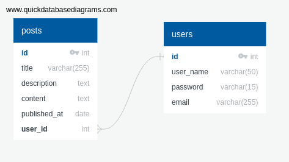

# unleash-your-potential
Simple Blog by using Express & Postgres .

## Team Names :
* Hashem Taha  
* Rana Obeid  
* Mohammad Alhalaq  
* Asmaa Thabet

## Table of contents
* [User Stories](#user-stories)
* [Our Idea](#our-idea)
* [User Journey](#user-journey)
* [Database](#database)
* [Our Steps](#our-steps)
* [Important packages](#important-packages)

## User Stories  
>As a user , when I open the blog I have to see landing Page that shows three main parts .

>As a user , in the first part [ header ] , I should see navigation bar that contian two important links: Login & Sign-in .   

>As a user , in the second part [main] , I should see list of posts that showing [title,description & content ]

>As a user , in the third part [footer], I should see copyrights statments & any other things related .

>As a user , If I have to add a new post , I have to login by login link in the header navbar if I was already registered .

>As a user , If I wasn't registered I have to navigate to sign up link in the header to sign up as new user .

>As a user I can see  a page that contain my main information.

## Our Idea
simple blog that show posts in it , you can add post when you logged in .
	
## User Journey  

* The User enter our Blog and see navbar that contain main links.   

* The User see list of posts under header part.

* The User see footer that contain copyrights section . 

* The User should signup to deal with the blog system . 

* The User should login after signing up . 

* The User can add blog post after login . 

* The User can see page that contain his/her own information by clicking on his/her name . 

## Database 

### Our Blog Schema digram : 


### SQL File :   

```
BEGIN;

DROP TABLE IF EXISTS users,posts CASCADE;
CREATE TABLE users(
    id SERIAL PRIMARY KEY,
    user_name VARCHAR(50),
    password VARCHAR(255),
    email VARCHAR(255)
);

CREATE TABLE posts(
    id SERIAL PRIMARY KEY,
    title VARCHAR(255),
    description TEXT,
    content TEXT,
    published_at DATE,
    user_id int,
    FOREIGN KEY (user_id) REFERENCES users(id)
);

COMMIT;
```   

### we have 3 types of databases in our project :
1- development database.     
2- Testing database .   
3- Production database [Heroku database].   


## Our Steps
* analyze project on papers : 
 we started our work by analyzing user journey and making database schema for the project.

* Design :    
 We design our project on papers to make a general perception for the website.

* Project Structure :   
We started to build our project files Structure by seprate our project into three folders which is public,src and test to make our work more organized.

* Installing important Packages : 
we install important packages that needed to run project .    

* Setup Travis in our project :   
We setup travis in the begining of our project 
to test our project with its test step by step and we add new local database for travis   .  

* Divided Tasks by writing issues :  
We divided the work in tasks and started to work as pair in every task.

* making tests :    
we made tests for our routes and database to check that they were work well .

* making sql file :   
make our database file to store schema in it .

* making Validation :    
we make validation to signup and login forms in server and client sides .

* Displaying Data In Page :   
We show our data  from database .

* Design Website :   
We make simple design for our website to obtain the required shape from our idea .

* Use Heroku :   
we use our Heroku to connect it with github and have a link to our project . 

## Important packages
* Express 
* express handlebars [to view data]
* env2 
* @hapi/joi [for server side validation]
* eslint 
* nodemon 
* supertest 
* tape & tap-spec 